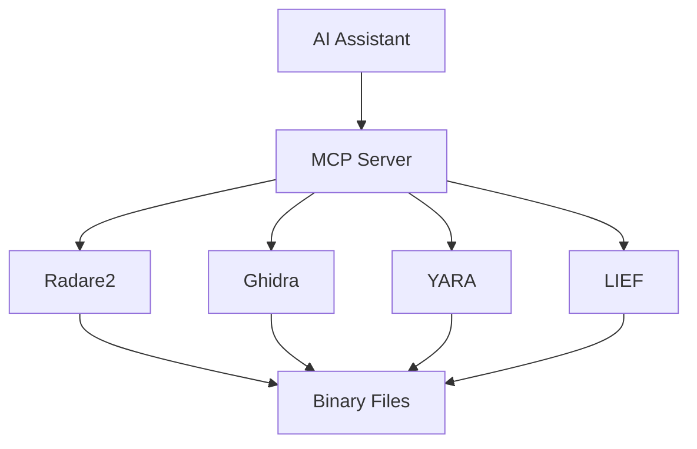

# Reversecore MCP

Welcome to **Reversecore MCP** - an AI-powered binary analysis platform built on the Model Context Protocol (MCP).

## What is Reversecore MCP?

Reversecore MCP provides AI assistants with powerful binary analysis capabilities:

- **Static Analysis**: Decompilation, disassembly, and structure recovery
- **Dynamic Analysis**: Code emulation and execution tracing
- **Threat Detection**: Automated malware analysis and YARA signature generation
- **Network Protocol Analysis**: Game protocol reverse engineering

## Quick Start

### Docker (Recommended)

```bash
docker pull ghcr.io/yourusername/reversecore_mcp:latest
docker run -v /path/to/workspace:/app/workspace reversecore_mcp
```

### From Source

```bash
git clone https://github.com/yourusername/Reversecore_MCP.git
cd Reversecore_MCP
pip install -r requirements.txt
python server.py
```

## Features

### 🔍 Binary Analysis

- Radare2-powered disassembly and analysis
- Ghidra integration for advanced decompilation
- LIEF for portable executable parsing
- Capstone for multi-architecture disassembly

### 🛡️ Threat Detection

- **Ghost Trace**: Hidden behavior detection
- **Neural Decompiler**: AI-enhanced code understanding
- **Trinity Defense**: Automated threat response pipeline
- **YARA Integration**: Signature generation and scanning

### 📊 Structured Output

All tools return structured JSON output suitable for AI consumption:

```json
{
  "success": true,
  "data": {
    "functions": [...],
    "strings": [...],
    "imports": [...]
  }
}
```

## Architecture



## Documentation

- [Installation Guide](getting-started/installation.md)
- [Configuration](getting-started/configuration.md)
- [API Reference](api/core/config.md)
- [Contributing](development/contributing.md)

## License

MIT License - see [LICENSE](https://github.com/yourusername/Reversecore_MCP/blob/main/LICENSE)
